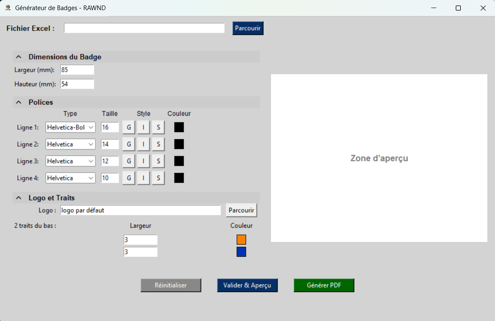

# 🎟️ Badge Generator App

A **Python application (Tkinter + ReportLab)** to generate **PDF badges** from an Excel file.  
Each row in the Excel file corresponds to **one badge**.

⚠️ **Each badge can contain a maximum of 4 lines of text**  
(for example: Name, Title, Company, Extra).  
The program only uses the **first 4 columns** of the Excel file (column names are ignored).

---

## ✨ Features
- Simple **graphical user interface** (Tkinter).
- **Customization** of badge dimensions, fonts, colors, lines, and logo (default values are set in `config.py`).
- **Live preview** of the badge before generation.
- Reset to **default configuration** if changes are not suitable.
- Import attendee data from Excel (`.xlsx`).
- Batch generation: **one badge per row**.
- Export to **multi-page PDF** (multiple badges per A4 page).
- User can select the **output PDF path**.
- Easy to package as an executable with **PyInstaller**.

---

## 📂 Repository Contents
- `organisation/` → source code of the application.
- `main.py` → main entry point.
- `requirements.txt` → required dependencies.
- `README.md` → this file.
- `docs/` → documentation and example files:
  - `interface.png` → screenshot of the main interface.
  - `sample_badge.png` → example of generated badge PDF.
  - `sample_attendees.xlsx` → example Excel file with 20 rows.


---

## ⚙️ Installation

```bash
# 1) Clone the repository
git clone https://github.com/ra-12-wnd/badge_generator.git
cd badge_generator

# 2) Create a virtual environment
python -m venv .venv
# Windows
.venv\Scripts\activate
# macOS/Linux
source .venv/bin/activate

# 3) Install dependencies
pip install -r requirements.txt
```
---

## 🚀 Usage

Run the application with:
```bash
python main.py
```
---

## 📸 Preview

Main interface:  


Example of generated PDF:  


Example input file (Excel):  
[📂 sample_attendees.xlsx](docs/sample_attendees.xlsx)

---

